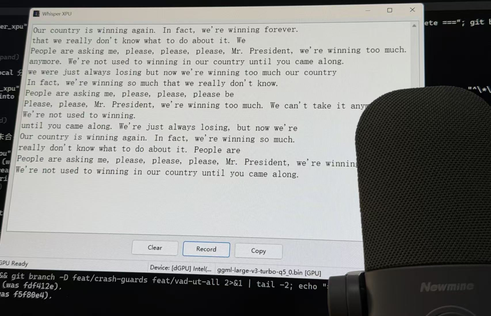

# whisper_xpu

> Real-time speech-to-text on Intel GPUs, via SYCL (oneAPI) + oneDNN.

`whisper_xpu` runs OpenAI's Whisper model on Intel Arc / Iris Xe GPUs using
Intel's SYCL runtime, with a live-streaming wxWidgets desktop app for
dictation — the foundation for a **voice-driven coding workflow**.

<!-- TODO: drop the app screenshot here as Images/app.png -->


## What it is

**Today** — a Windows desktop app that captures your microphone continuously,
slices it into 5-second windows, and transcribes each window on the GPU as it
arrives — text appears live, word by word, with overlap-deduplication so no
words are dropped or duplicated at the boundaries. Whisper.cpp's SYCL backend
does the compute; oneDNN accelerates the GEMM path; the scheduler runs a
small worker pool so capture and transcription stay decoupled (you can record
while a model is still loading).

**Where it's heading** — a voice-driven coding agent / workflow: speak
naturally and have the transcript drive coding actions, not just land in a text
box. The streaming transcription engine here is the substrate; the longer arc
is wiring that stream into a coding loop (draft → edit → run → iterate) by
voice. The current release is the "speak → reliable live text" step on that
path.

Chinese output can be rendered in Simplified or Traditional glyphs on the fly
(vendored OpenCC dictionaries), regardless of what Whisper emitted.

## Quick start

### Option A — download the release (easiest)

Grab **`whisper_xpu_v1.0.0.zip`** from the
[latest release](https://github.com/xuhancn/whisper_xpu/releases/latest).
Unzip → double-click `whisper_xpu_app.exe` → it works (no oneAPI
environment, no build step). It ships with `ggml-tiny.bin` and defaults to
**CPU** so it runs on any Windows 11 machine; open **Settings** (click the
status bar) to pick a larger model or the Intel Arc GPU for much faster
transcription.

Requirements on the target machine: Windows 10/11 x64, a microphone, and —
only if you want GPU — an Intel Arc / Iris Xe driver recent enough to provide
`ze_loader.dll` (the Intel GPU driver, in System32). CPU mode needs nothing
extra.

### Option B — build from source

Only the **verified** build path is documented below (Ninja + oneAPI 2025.3
on Windows). Other generators/platforms were explored but are not kept here
because they weren't reliably green.

## Models

The release zip ships **only** `ggml-tiny.bin` (~77 MB) — enough to run
out of the box, and tiny is fast on CPU. For real use you'll want a larger,
more accurate model; download it yourself into `models/` and point Settings
(or `whisper_xpu.ini`) at it.

The `q5_0` (5-bit) quantized models are the verified, recommended set —
they work on both CPU and the Intel GPU. Download from the official
[whisper.cpp HuggingFace repo](https://huggingface.co/ggerganov/whisper.cpp)
(`ggerganov/whisper.cpp`):

| Model | File | Size | Verified |
|---|---|---|---|
| tiny | `ggml-tiny.bin` | ~77 MB | ✓ (ships in the release) |
| medium | `ggml-medium-q5_0.bin` | ~540 MB | ✓ (CPU + GPU) |
| large-v3 | `ggml-large-v3-q5_0.bin` | ~1.0 GB | ✓ (CPU + GPU) |
| large-v3 turbo | `ggml-large-v3-turbo-q5_0.bin` | ~570 MB | ✓ (CPU + GPU) |

Download (pick one):

```powershell
# e.g. the turbo model — faster + accurate:
curl -L -o models/ggml-large-v3-turbo-q5_0.bin `
  https://huggingface.co/ggerganov/whisper.cpp/resolve/main/ggml-large-v3-turbo-q5_0.bin
# or the full large-v3 (most accurate, slowest):
curl -L -o models/ggml-large-v3-q5_0.bin `
  https://huggingface.co/ggerganov/whisper.cpp/resolve/main/ggml-large-v3-q5_0.bin
```

Then set it as the default — either open Settings and pick it, or edit
`whisper_xpu.ini`:

```ini
model=models/ggml-large-v3-turbo-q5_0.bin
```

> **On the GPU, prefer `q5_0` over `q8_0`.** Verified: `ggml-large-v3-turbo-q8_0.bin`
> transcribes correctly on **CPU** (172 chars, real text) but produces **empty
> output on the Intel Arc GPU** (0 chars) — while the `q5_0` models above work
> on both. Use `q5_0` on the GPU.

## Build from source (verified)

### Prerequisites

- **Windows 10/11**
- [Intel oneAPI Base Toolkit](https://www.intel.com/content/www/us/en/developer/tools/oneapi/base-toolkit.html)
  **2025.3** — provides the SYCL compiler (`icx`/`icpx`) and `sycl8.dll`.
  2025.3 is the **verified** toolchain. Newer (2026.1, `sycl9.dll`) and
  older versions are not tested in this repo. Pin 2025.3.
- [Ninja](https://ninja-build.org/) 1.11+ (`winget install Ninja-build.Ninja`)
- Visual Studio 2022 (Build Tools or IDE) — "Desktop development with C++"
- CMake 3.22+
- Git (the repo uses submodules: whisper.cpp, wxWidgets, portaudio, oneDNN)

> The SYCL core's GPU kernels are compiled by an `icx` + Ninja *sub-build* of
> whisper.cpp (driven by CMake `ExternalProject`), which bundles the SPIR-V
> device image into `ggml-sycl.dll`. The GUI app, wxWidgets, portaudio, and the
> thin SYCL-core wrapper stay on MSVC — the project's MSVC/icx split is what
> the `cl` override below preserves.

### Configure + build

```powershell
# 1. Pin oneAPI 2025.3 (the verified toolchain; the root setvars.bat loads
#    the latest version — see Notes).
$env:VS2022INSTALLDIR = "C:\Program Files (x86)\Microsoft Visual Studio\2022\BuildTools"
& "C:\Program Files (x86)\Intel\oneAPI\2025.3\oneapi-vars.bat"

# 2. Configure. Force `cl` as the TOP-LEVEL compiler — wxWidgets rejects icx
#    ("Unknown WIN32 compiler type"). The whisper.cpp + oneDNN sub-builds
#    still use icx (they set -DCMAKE_C_COMPILER=icx themselves). Ninja is
#    single-config, so Release is fixed at configure time.
cmake -S . -B build-gpu -G Ninja `
      -DCMAKE_BUILD_TYPE=Release `
      -DCMAKE_C_COMPILER=cl `
      -DCMAKE_CXX_COMPILER=cl

# 3. Build the app (and the headless test for verification).
cmake --build build-gpu --parallel
```

> `-DGGML_SYCL` / `-DGGML_SYCL_DNN` at the top level are **no-ops** — the
> whisper.cpp sub-build hardcodes them. Don't rely on top-level flags to
> toggle SYCL.

### Verify

Run the headless pipeline (CPU — deterministic; then GPU):

```powershell
.\build-gpu\tests\streaming_pipeline\test_pipeline.exe `
    --model models\ggml-tiny.bin `
    --audio tests\bench_vad\trump_60s_final.wav --cpu
# → ALL PASSED (failures=0)  /  RESULT: GOT TEXT

# GPU path (Intel Arc device 0):
.\build-gpu\tests\streaming_pipeline\test_pipeline.exe `
    --model models\ggml-tiny.bin `
    --audio tests\bench_vad\trump_60s_final.wav --device 0
```

The GUI app lands at `build-gpu\whisper-xpu-app\Release\whisper_xpu_app.exe`.
Run it from a shell that sourced `oneapi-vars.bat`, or double-click once the
oneAPI runtime DLLs are co-located beside it (the build copies most of them
automatically — see the runtime-DLL list below).

### Runtime DLLs

The build co-locates beside each executable:

- `whisper_xpu_sycl_core.dll` — the SYCL core (engine, merge_segments, device_detect)
- `whisper.dll`, `ggml.dll`, `ggml-base.dll`, `ggml-cpu.dll` — CPU/backend chain
- `ggml-sycl.dll` (~120 MB, SPIR-V device image bundled by the icx/Ninja link)
- oneAPI runtime (copy of whatever exists under 2025.3): `sycl8.dll`,
  `ur_loader.dll`, `ur_adapter_level_zero.dll`, `libmmd.dll`, `libiomp5md.dll`,
  `tcm.dll`, the oneMKL SYCL + Level Zero adapters, …

Any oneAPI DLL not copied is resolved via the `oneapi-vars.bat` `PATH`. For a
clean run without oneAPI sourced, copy the missing DLL from
`C:\Program Files (x86)\Intel\oneAPI\compiler\2025.3\bin\` next to the exe.

## Release packaging

Build a drop-and-run zip (see PR #33):

```powershell
cmake -S . -B build-gpu -DWHISPER_XPU_RELEASE=ON
cmake --build build-gpu --target release_package
# → build-gpu\whisper_xpu_v1.0.0.zip
```

The zip bundles the exe, all runtime DLLs, `ggml-tiny.bin` + the VAD model,
the OpenCC zh-converter dicts, and a default `whisper_xpu.ini` (tiny + CPU).
Default `OFF` — dev builds skip the packaging cost.

## Notes (注意事项)

A few non-obvious behaviors and constraints worth knowing before building or running.

- **Pin oneAPI 2025.3.** 2025.3 (ships `sycl8.dll`) is the verified toolchain
  for the GPU path. Newer (2026.1, `sycl9.dll`) is not tested in this repo — it
  is not known to be broken, just not validated here. The root `setvars.bat`
  loads the latest version — use the per-version `2025.3\oneapi-vars.bat` to pin.
- **Under `-G Ninja`, force `cl` at the top level.** CMake picks `icx` first on
  PATH after oneapi-vars; wxWidgets then aborts with `Unknown WIN32 compiler
  type`. Pass `-DCMAKE_C_COMPILER=cl -DCMAKE_CXX_COMPILER=cl` — the whisper.cpp
  and oneDNN sub-builds still use `icx` (they set it themselves).
- **`ggml-sycl.dll` must carry the SPIR-V device image.** `lld-link` silently
  ignored `-fsycl`, so the DLL had no GPU kernels and the first compute
  reported `No kernel named im2col_sycl<half>`. The fix is the `icx`/Ninja
  sub-build that bundles the SPIR-V image (an `icx-cl` relink also works).
- **Prime the GPU before workers touch it.** SYCL's first-kernel JIT +
  per-state buffer alloc must run on the **load thread** (`warmup_states`)
  *before* any worker issues its first GPU compute, or the app AVs. Warmup
  runs serially; workers run parallel afterward.
- **Multi-worker shared SYCL queue.** Whisper's "one context +
  N states" pool ran 4 workers, each calling `whisper_full_with_state`. But
  `ggml-sycl`'s `stream()` returns the device's **`default_queue()` singleton**,
  so all 4 workers submitted `parallel_for`/malloc/free to the **same
  `sycl::queue`** concurrently. `sycl::queue` is **not thread-safe** for that →
  intermittent AV (`c0000005`, read `0xFFFF…FFFF` in a mul_mat pool dtor) or
  fast-fail abort (`c0000409` at `ggml_backend_sycl_synchronize`). This was
  initially attributed to the driver before the shared-queue cause was found.
  **Fix: `POOL_SIZE=1` on GPU**
  (one worker serializes queue access, zero locks); CPU keeps 4 workers
  (ggml-cpu is thread-safe per call).
- **iGPU (Intel Iris Xe).** Its older NEO driver rejected the SYCL build option
  `-ze-intel-greater-than-4GB-buffer-required` (`urProgramBuildExp` →
  `UR_RESULT_ERROR_UNSUPPORTED_FEATURE`) → crash on load. It became usable after
  a driver update (32.0.101.7088+); the device dropdown now shows it and a
  SEH-guarded init probe marks it `(driver unavailable)` if its driver can't
  init a SYCL backend.
- **Status-bar garble `[loading***`.** The source is `/utf-8`, so the `…`
  ellipsis (U+2026) and any non-ASCII name are UTF-8 bytes, but `wxString(char*)`
  decoded them with the system locale (GBK 936) → garbage. Fixed by routing
  all rendered strings through `wxString::FromUTF8`.
- **Avoid attaching `cdb` to a live run.** A debugger attachment triggers an
  *unrelated* Intel Level Zero driver fault on its debug/tracer path
  (`zetModuleGetDebugInfo` reads a sentinel), which is separate from the real
  multi-worker crash. To capture crashes, register **WER LocalDumps**
  (`enable_wer_dump.bat`, HKLM, run as admin) → auto-minidump on crash with no
  debugger attached; analyze offline with `cdb -z <dump>` (full PDBs are built
  when you enable the ggml-sycl `/Zi`+`/DEBUG` + RelWithDebInfo sub-build).
- **Whisper `detect_language=true` means detect-and-exit** (0 transcription).
  Use `language="auto"` with `detect_language=false` for actual transcription.

## Project structure

```
cmake/                      — FindSYCLToolkit.cmake, FindDNNL.cmake
whisper-xpu-core/           — SYCL core DLL (whisper_xpu_sycl_core.dll)
  sycl_src/                   — device detection + SYCL probe sources
whisper-xpu-app/            — wxWidgets GUI app + transcription scheduler
tests/streaming_pipeline/   — headless pipeline unit test (test_pipeline)
third_party/                — whisper.cpp, wxWidgets, portaudio, oneDNN
```

## License

MIT — see [LICENSE](LICENSE).
